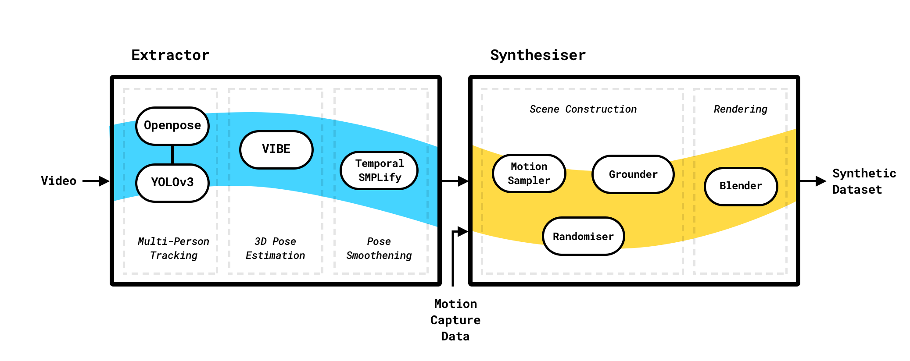

# Synthetic Datasets for Human Motion Recognition

## Installation

Requirements:
 - unzip
 - ffmpeg
 - gdown (for prepare_data.sh)

1. Make a virtualenv
2. Install gdown from pip
3. Install unzip and ffmpeg
4. `pip install -r requirements.txt`

## Usage

See `python main.py --help` for all options.

Examples:
`python main.py --video_folder ~/videos`